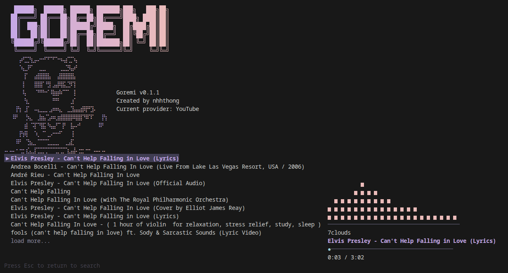
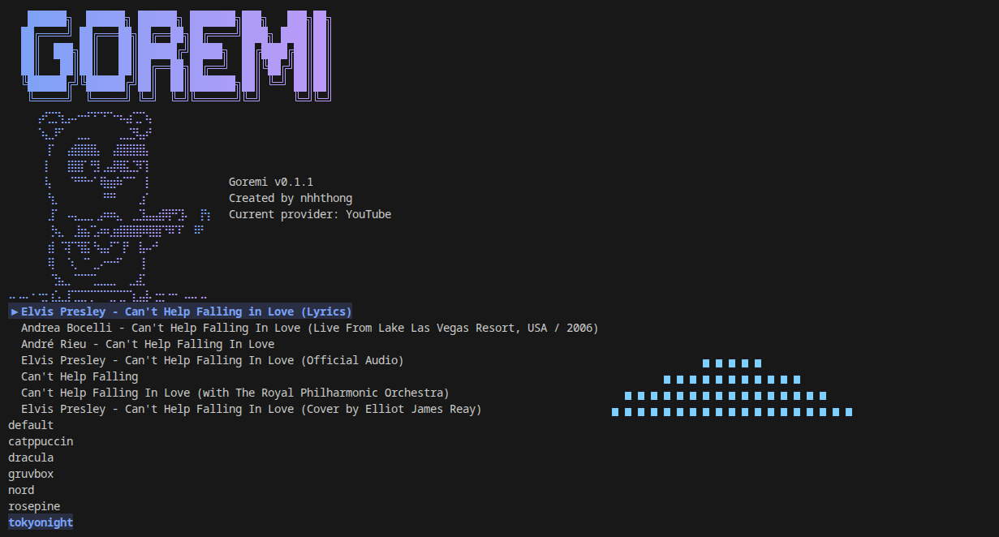

<div align="center">
  

  <p><strong>Terminal music player. Search, select, listen.</strong></p>

  <p>
    
    
    
  </p>
</div>

---

## About

GoReMi (**Go** + **Do Re Mi**) is a minimal music player for your terminal. Type a song, pick a result, and it plays, with a live spectrum and themes, all from the keyboard. Music comes from YouTube, played by [mpv](https://mpv.io/) and found with [yt-dlp](https://github.com/yt-dlp/yt-dlp).

## Demo

https://github.com/user-attachments/assets/8d8f0d2e-84e9-4c57-ab71-e180a2f8dfe8

| Playing | Change theme |
|---|---|
|  |  |

## Install

**Linux and macOS:**

```sh
curl -fsSL https://raw.githubusercontent.com/nhhthong/goremi/main/install.sh | sh
```

**Windows** (PowerShell): download `install.ps1` from this repository and run it.

The script installs `goremi` and offers to install `mpv` and `yt-dlp` if they are missing; you only confirm. Make sure the install directory is on your `PATH` (`~/.local/bin` on Linux and macOS, `%LocalAppData%\Programs\goremi` on Windows).

**From source** (Go 1.26 or newer):

```sh
make build    # writes bin/goremi
```

> No release is published yet, so the install scripts work only after the first release.

## Use

Run `goremi`, type a query and press `Enter`.

| Key | Action |
|---|---|
| `↑` `↓` | select a track |
| `Enter` | play the track, or load more results |
| `Space` or `k` | play or pause |
| `j` / `l` | seek back / forward 10 seconds |
| `p` / `n` | previous / next track |

Type `/` in the search bar for commands: `/theme` changes the theme, `/quit` quits. `Ctrl+C` quits from anywhere.

## Configuration

Optional file `config.toml` in your user config directory (`~/.config/goremi/` on Linux, `~/Library/Application Support/goremi/` on macOS, `%AppData%\goremi\` on Windows):

```toml
[ui]
theme = "default"       # set by /theme
show_spectrum = true
mouse = true            # click or drag the player bar and controls
```

A missing file or an unknown value never stops the player.
